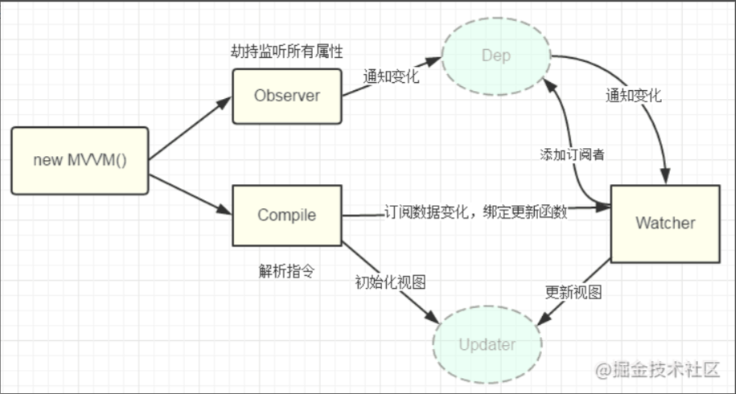
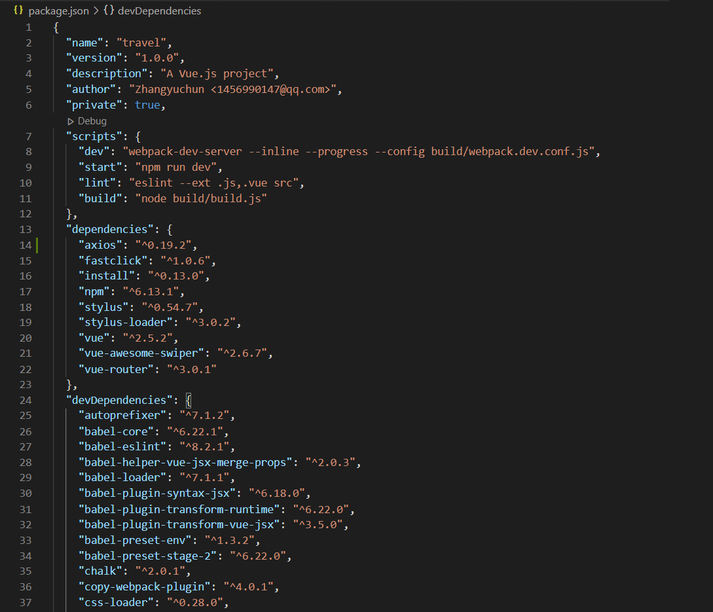

# vue和react的区别

相同点：

1. 都有虚拟DOM（Virtual DOM 是一个映射真实DOM的JavaScript对象）
2. 都提供了响应式和组件化的视图组件。

不同点： Vue 是`MVVM`框架，双向数据绑定，当`ViewModel`对`Model`进行更新时，通过数据绑定更新到`View`。

React是一个单向数据流的库，状态驱动视图。`State --> View --> New State --> New View` `ui = render (data)`。

模板渲染方式不同。React是通过JSX来渲染模板，而Vue是通过扩展的HTML来进行模板的渲染。

组件形式不同，Vue文件里将HTML，JS，CSS组合在一起。react提供class组件和function组

Vue封装好了一些v-if，v-for，React什么都是自己实现，自由度更高。

# 简述MVVM

**MVVM**是`Model-View-ViewModel`缩写，也就是把`MVC`中的`Controller`演变成`ViewModel。Model`层代表数据模型，`View`代表UI组件，`ViewModel`是`View`和`Model`层的桥梁，它有两个方向，第一将后端传来的数据转换成页面可以看到的视图，第二，将用户在页面上的交互转化成为后端数据我们称之为双向绑定。
**也可以这么说：**视图和模型是不能直接通信的，它们通过ViewModel来通信，ViewModel通常要实现一个observer观察者，当数据发生变化，ViewModel能够监听到数据的这种变化，然后通知到对应的视图做自动更新，而当用户操作视图时，ViewModel也能监听到视图的变化，然后通知数据做改动，这实际上就实现了数据的双向绑定。

# 对VUE的渐进式框架如何理解

从技术方面来说，可以根据自己的业务来选择你需要的vue功能模块。就是用你想用或者能用的功能特性，你不想用的部分功能可以先不用。VUE不强求你一次性接受并使用它的全部功能特性。

可参考：[渐进式的理解](https://blog.csdn.net/wangzunkuan/article/details/80729683?utm_medium=distribute.pc_relevant_t0.none-task-blog-2%7Edefault%7EBlogCommendFromMachineLearnPai2%7Edefault-1.essearch_pc_relevant&depth_1-utm_source=distribute.pc_relevant_t0.none-task-blog-2%7Edefault%7EBlogCommendFromMachineLearnPai2%7Edefault-1.essearch_pc_relevant)

# VUE生命周期函数

- beforeCreate：实例刚在内存中被创建出来，此时，还没有初始化好 data 和 methods 属性
- created：实例已经在内存中创建OK，此时 data 和 methods 已经创建OK，此时还没有开始编译模板。我们可以在这里进行Ajax请求。
- beforeMount：此时已经完成了模板的编译，但是还没有挂载到页面中
- mounted：此时，已经将编译好的模板，挂载到了页面指定的容器中显示。（mounted之后，表示**真实DOM渲染完了，可以操作DOM了**）
- beforeUpdate：状态更新之前执行此函数， 此时 data 中的状态值是最新的，但是界面上显示的 数据还是旧的，因为此时还没有开始重新渲染DOM节点
- updated：实例更新完毕之后调用此函数，此时 data 中的状态值 和 界面上显示的数据，都已经完成了更新，界面已经被重新渲染好了。
- beforeDestroy：实例销毁之前调用。在这一步，实例仍然完全可用。
- destroyed：Vue 实例销毁后调用。调用后，Vue 实例指示的所有东西都会解绑定，所有的事件监听器会被移除，所有的子实例也会被销毁。

PS：可以在beforeDestroy里**清除定时器、或清除事件绑定**。

# 什么是虚拟DOM？

虚拟dom 是相对于浏览器所渲染出来的真实dom 的，在react，vue 等技术出现之前， 我们要改变页面展示的内容只能通过遍历查询dom 树的方式找到需要修改的dom 然 后修改样式行为或者结构，来达到更新ui 的目的。 这种方式相当消耗计算资源，因为每次查询dom 几乎都需要遍历整颗dom 树，如果 建立一个与dom 树对应的虚拟dom 对象（ js 对象），以对象嵌套的方式来表示dom 树，那么每次dom 的更改就变成了js 对象的属性的更改，这样一来就能查找js 对象的属性变化要比查询dom 树的性能开销小。

# 怎么理解Vue中的diff算法

# computed和watch的区别

计算属性可以是**一个函数**或者是一个**getter和setter组成**的对象。

watch主要监视数据的变化，具有deep和immediate两个属性。

**总括：**computed主要用于同步对数据的处理，而watch主要用域事件的派发，可以异步。computed 和 watch 的使用场景并不一样，computed 的话是**通过几个数据的变化，来影响一个数据，**而 watch，则是可以**一个数据的变化，去影响多个数据。**

**computed支持缓存，只有依赖数据结果发生改变，才会重新进行计算，不支持异步操作，如果一个属性依赖其他属性，多对一，一般用computed应用场景比如：购物车计算总额。**

**watch数据变，直接触发相应操作，支持异步，监听数据必须`data`中声明过或者父组件传递过来的`props中`的数据，当数据变化时，触发其他操作，函数有两个参数。应用场景比如：当借款额度超过可借额度时，弹出toast提示。**

**computed** 跟 **methods** 里面的方法的区别，computed 的话访问的时候会直接返回已缓存的结果，而不会像 methods 一样再次计算。

# 组件之间传值

- ### props/$emit+v-on

  父组件通过props的方式向子组件传递数据，而通过$emit 子组件可以向父组件通信

- ### eventBus

  通过eventBus向中心事件发送或者接收事件，所有事件都可以共用事件中心

- ### vuex

  状态管理模式，采用集中式存储管理应用的所有组件的状态，可以通过vuex管理全局的数据

[参考文章](https://juejin.cn/post/6844903887162310669)    只需要熟悉上面三种即可，其他基本不会用到，可以做为了解。

# 常用指令

v-model：数据绑定；

v-for：循环； 格式：v-for=“字段名 in(of)数组json"；

v-show: 显示隐藏   传递值为布尔值 true  false  默认false；

v-if：显示与隐藏；（v-show对比区别就是是否删除dom节点，默认是false）

v-else-if：必须和v-if连用，不能单独使用否则报错，模版编译错误；

v-bind：动态绑定；作用：及时对页面的数据进行更改；可用：代替

v-on：绑定事件，函数必须写在methods里面；（@click快捷写法）

v-text：解析文本；

v-bind：class；

v-once：进入页面时，只渲染一次，不再进行渲染；

v-cloak：防止闪烁；

v-pre：把标签内部的元素原位输出；

**插播**：data：返回对象用return

# v-if和v-for能不能一起使用

v-for指令的优先级要高于v-if，当处于同一节点时候，意味着v-if将分别重复运行于每个 v-for 循环中，所以应该尽量避免v-for和v-if在同一结点。

# v-if和v-show的区别

v-if是条件渲染，是真正的渲染，表示dom节点是否存在。

v-show是隐藏显示，表示dom节点一直存在，只是存在的方式不同（或隐藏或显示）。

如果需要频繁切换显示/隐藏的可以用v-show;如果运行后不太可能需要切换显示/隐藏的可以用v-if；

# v-model的实现原理

v-model主要提供了两个功能，view层输入值影响data的属性值，data属性值发生改变会更新view层的数值变化。`v-model`是语法糖，默认情况下相于:`value和@input`。

其核心就是，一方面modal层通过defineProperty来劫持每个属性，一旦监听到变化通过相关的页面元素更新。另一方面通过编译模板文件，为控件的v-model绑定input事件，从而页面输入能实时更新相关data属性值。

v-model是什么

v-model就是vue的双向绑定的指令，能将页面上控件输入的值同步更新到相关绑定的data属性，也会在更新data绑定属性时候，更新页面上输入控件的值。

为什么使用v-model

v-model作为双向绑定指令也是vue两大核心功能之一，使用非常方便，**提高前端开发效率**。在view层，model层相互需要数据交互，即可使用v-model。

[参考文章](https://www.jianshu.com/p/2012c26b6933)

# 双向绑定实现原理

当一个**Vue**实例创建时，Vue会遍历data选项的属性。Vue采用数据劫持结合发布者-订阅者模式的方式，通过`Object.defineProperty()`来劫持各个属性的`setter`，`getter`，`dep.addSub`来收集订阅的依赖，`watcher`监听数据的变化，在数据变动时发布消息给订阅者，触发相应的监听回调。

监听器`Observer`，用来劫持并监听所有属性，如果有变动的，就通知订阅者。 订阅者`Watcher`，可以收到属性的变化通知并执行相应的函数，从而调用对应update更新视图。



[参考文章](https://juejin.cn/post/6991724298197008421#heading-6)

# v-for中key的作用

key主要用在Vue的虚拟DOM算法，用来对比新旧节点。如果不使用key，Vue 会使用一种最大限度减少动态元素并且尽可能的尝试就地修改/复用相同类型元素的算法。而使用key时，它会基于key 的变化重新排列元素顺序，并且会移除key 不存在的元素。

作用：v-for中key的作用主要是为了更高效的对比更新虚拟dom。

原理：vue在执行diff算法比较两个虚拟dom节点是否是相同节点时，会先看key是否相同，再看标签类型等是否相同。

注意：实际开发过程中渲染一组列表时，key必须设置（节省性能），且应该尽量避免使用索引作为key（有的时候列表发生排序），这样容易导致一些隐藏bug。

# vue项目中package.json属性

部分截图如下：



包括项目名字、版本、描述、作者、是否私有。还包括其他一些属性，即

```
scripts：支持的脚本，默认是一个空的test
dependencies: 生产环境依赖包列表
devDependencies: 开发环境、测试环境依赖包列表
engines: 声明项目需要的node或npm版本范围
browserslist: 支持的浏览器列表
```

# NextTick的实现


# keep-alive的实现


# 实现双向绑定 Proxy 与 Object.defineProperty 相比优劣如何?

1. **Object.definedProperty**的作用是劫持一个对象的属性，劫持属性的getter和setter方法，在对象的属性发生变化时进行特定的操作。而 Proxy劫持的是整个对象。
2. **Proxy**会返回一个代理对象，我们只需要操作新对象即可，而Object.defineProperty只能遍历对象属性直接修改。
3. **Object.definedProperty**不支持数组，更准确的说是不支持数组的各种API，因为如果仅仅考虑arry[i] = value 这种情况，是可以劫持的，但是这种劫持意义不大。而Proxy可以支持数组的各种API。
4. 尽管Object.defineProperty有诸多缺陷，但是其兼容性要好于Proxy。

[参考文章](https://blog.csdn.net/wangzunkuan/article/details/80729683?utm_medium=distribute.pc_relevant_t0.none-task-blog-2%7Edefault%7EBlogCommendFromMachineLearnPai2%7Edefault-1.essearch_pc_relevant&depth_1-utm_source=distribute.pc_relevant_t0.none-task-blog-2%7Edefault%7EBlogCommendFromMachineLearnPai2%7Edefault-1.essearch_pc_relevant)

# 你知道Vue3有哪些新特性吗？它们会带来什么影响？

- **性能提升**

更小巧、更快速 支持自定义渲染器 支持摇树优化：一种在打包时去除无用代码的优化手段 支持Fragments和跨组件渲染

- **API变动**

模板语法99%保持不变 原生支持基于class的组件，并且无需借助任何编译及各种stage阶段的特性 在设计时也考虑TypeScript的类型推断特性 `重写虚拟DOM`可以期待更多的编译时提示来减少运行时的开销 `优化插槽生成`可以单独渲染父组件和子组件 `静态树提升`降低渲染成本 `基于Proxy的观察者机制`节省内存开销

- **不兼容IE11**

`检测机制`更加全面、精准、高效,更具可调试式的响应跟踪

# 对SPA的理解

SPA（ single-page application ）仅在 Web 页面初始化时加载相应的 HTML、JavaScript 和 CSS。一旦页面加载完成，SPA 不会因为用户的操作而进行页面的重新加载或跳转；取而代之的是利用路由机制实现 HTML 内容的变换，UI 与用户的交互，避免页面的重新加载。

**优点：**

- 用户体验好、快，内容的改变不需要重新加载整个页面，避免了不必要的跳转和重复渲染；
- 基于上面一点，SPA 相对对服务器压力小；
- 前后端职责分离，架构清晰，前端进行交互逻辑，后端负责数据处理；

**缺点：**

- 初次加载耗时多：为实现单页 Web 应用功能及显示效果，需要在加载页面的时候将 JavaScript、CSS 统一加载，部分页面按需加载；
- 前进后退路由管理：由于单页应用在一个页面中显示所有的内容，所以不能使用浏览器的前进后退功能，所有的页面切换需要自己建立堆栈管理；
- SEO 难度较大：由于所有的内容都在一个页面中动态替换显示，所以在 SEO 上其有着天然的弱势。

[参考文章](https://juejin.cn/post/6844903918753808398)

# vue-router的实现原理


# vuex实现原理


# 路由懒加载原理

### vue-router实现路由懒加载（动态加载路由）

- 把不同路由对应的组件分割成不同的代码块，然后当路由被访问时才加载对应的组件即为路由的懒加载，可以加快项目的加载速度，提高效率

```
const router = new VueRouter({
  routes: [
    {
      path: '/home',
      name: 'Home'，
      component:() = import('../views/home')
		}
  ]
})
```

# 性能优化

```js
编码阶段
尽量减少data中的数据，data中的数据都会增加getter和setter，会收集对应的watcher
v-if和v-for不能连用
如果需要使用v-for给每项元素绑定事件时使用事件代理
SPA 页面采用keep-alive缓存组件
在更多的情况下，使用v-if替代v-show
key保证唯一
使用路由懒加载、异步组件
防抖、节流
第三方模块按需导入
长列表滚动到可视区域动态加载
图片懒加载
SEO优化
预渲染
服务端渲染SSR
打包优化
压缩代码
Tree Shaking/Scope Hoisting
使用cdn加载第三方模块
多线程打包happypack
splitChunks抽离公共文件
sourceMap优化
用户体验
骨架屏
PWA
还可以使用缓存(客户端缓存、服务端缓存)优化、服务端开启gzip压缩等。
```

[Vue 项目性能优化 — 实践指南](https://juejin.cn/post/6844903913410314247)